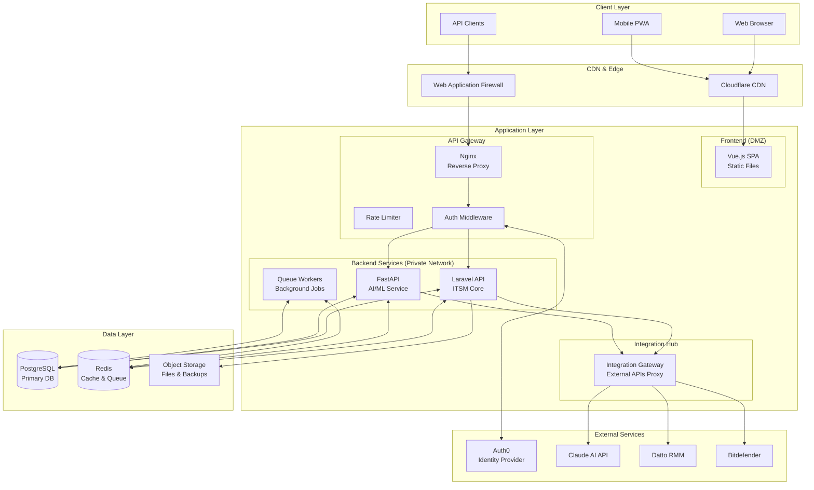
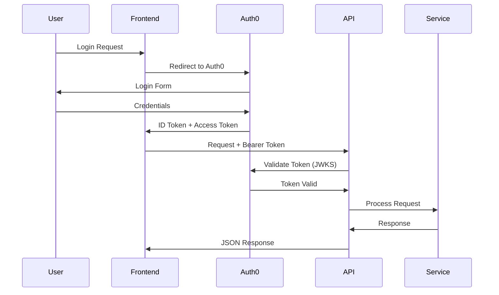
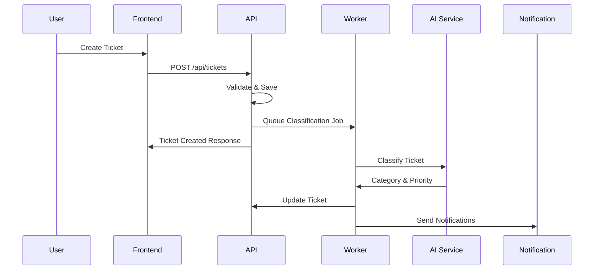
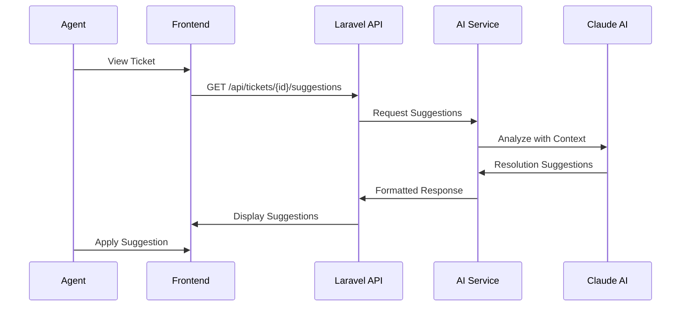

# 🏗️ Arquitetura do Sistema - ITSM Platform

## Visão Geral

O ITSM Platform utiliza uma arquitetura híbrida moderna combinando microserviços com uma abordagem Domain-Driven Design (DDD). A plataforma é construída com foco em segurança Zero-Trust, escalabilidade e manutenibilidade.

## Arquitetura de Alto Nível



## Componentes Principais

### 1. Frontend Layer (Vue.js SPA)

**Responsabilidades:**
- Interface de usuário responsiva e moderna
- State management com Pinia
- Comunicação com API via Axios
- Real-time updates via WebSockets
- Autenticação OAuth2/OIDC com Auth0

**Tecnologias:**
- Vue.js 3 com Composition API
- TypeScript para type safety
- Tailwind CSS para estilização
- Vite para build tooling
- PWA capabilities

**Segurança:**
- Servido como arquivos estáticos via CDN
- Content Security Policy (CSP) headers
- Subresource Integrity (SRI)
- Sem segredos ou lógica sensível

### 2. Backend Core (Laravel API)

**Responsabilidades:**
- Lógica de negócio ITSM
- Gestão de tickets e workflows
- Multi-tenancy e isolamento de dados
- APIs RESTful e GraphQL
- Integração com serviços externos

**Arquitetura DDD:**
```
app/
├── Domains/           # Bounded Contexts
│   ├── Incident/     # Gestão de Incidentes
│   ├── ServiceRequest/ # Requisições de Serviço
│   ├── Problem/      # Gestão de Problemas
│   ├── Change/       # Gestão de Mudanças
│   └── Asset/        # CMDB
├── Core/             # Shared Kernel
│   ├── Tenant/       # Multi-tenancy
│   ├── Auth/         # Autenticação
│   └── Workflow/     # Engine de Workflow
└── Infrastructure/   # Implementações
    ├── Persistence/  # Repositories
    └── Integration/  # External APIs
```

**Padrões Implementados:**
- Repository Pattern
- Service Layer
- Action Classes
- Data Transfer Objects (DTOs)
- Event Sourcing para auditoria

### 3. AI/ML Service (Python FastAPI)

**Responsabilidades:**
- Processamento de linguagem natural
- Classificação automática de tickets
- Análise preditiva e anomalias
- Integração com Claude AI
- Machine Learning pipelines

**Arquitetura:**
```
app/
├── api/              # FastAPI endpoints
├── ml/               # ML models e pipelines
├── services/         # Business logic
├── integrations/     # Claude AI, OpenAI
└── workers/          # Celery tasks
```

**Features de IA:**
- Classificação automática de incidentes
- Sugestões de resolução
- Análise de sentimento
- Detecção de anomalias
- Previsão de SLA

### 4. Data Layer

#### PostgreSQL (Primary Database)
- **Versão**: 16+
- **Features utilizadas**:
  - Row Level Security (RLS) para multi-tenancy
  - JSONB para dados flexíveis
  - Full-text search para knowledge base
  - Partitioning para tabelas grandes
  - Materialized views para analytics

**Schema Design:**
```sql
-- Multi-tenant base
CREATE TABLE tenants (
    id UUID PRIMARY KEY,
    name VARCHAR(255) NOT NULL,
    subdomain VARCHAR(100) UNIQUE,
    settings JSONB DEFAULT '{}'
);

-- Tickets com RLS
CREATE TABLE tickets (
    id UUID PRIMARY KEY,
    tenant_id UUID REFERENCES tenants(id),
    number VARCHAR(20) NOT NULL,
    title TEXT NOT NULL,
    -- ... outros campos
) PARTITION BY RANGE (created_at);

-- Enable RLS
ALTER TABLE tickets ENABLE ROW LEVEL SECURITY;

-- Policy para isolamento
CREATE POLICY tenant_isolation ON tickets
    FOR ALL TO application_role
    USING (tenant_id = current_setting('app.current_tenant')::uuid);
```

#### Redis (Cache & Queue)
- **Uso como Cache**:
  - Session storage
  - API rate limiting
  - Query result caching
  - Real-time metrics

- **Uso como Queue**:
  - Laravel Horizon para job processing
  - Pub/Sub para eventos real-time
  - Delayed jobs e scheduling

### 5. Security Architecture

#### Zero-Trust Principles
1. **Princípio do Menor Privilégio**: Cada serviço tem apenas as permissões necessárias
2. **Verificação Contínua**: Todas as requisições são autenticadas e autorizadas
3. **Isolamento de Rede**: Backend em rede privada sem acesso direto à internet
4. **Criptografia Everywhere**: TLS 1.3 para comunicação, AES-256 para dados em repouso

#### Authentication & Authorization


#### Security Layers
1. **WAF (Cloudflare)**: Proteção contra DDoS, bots maliciosos
2. **API Gateway**: Rate limiting, request validation
3. **Application**: Input sanitization, SQL injection prevention
4. **Database**: Encryption at rest, RLS, audit logging

### 6. Integration Architecture

#### Integration Hub Pattern
Todas as integrações externas passam por um gateway centralizado:

```python
# Integration Gateway Example
class IntegrationGateway:
    def __init__(self):
        self.rate_limiter = RateLimiter()
        self.circuit_breaker = CircuitBreaker()
        self.retry_policy = RetryPolicy(max_attempts=3)
    
    async def call_external_api(self, service: str, endpoint: str, data: dict):
        # Rate limiting
        await self.rate_limiter.check(service)
        
        # Circuit breaker
        if not self.circuit_breaker.is_open(service):
            try:
                response = await self.retry_policy.execute(
                    self._make_request, service, endpoint, data
                )
                self.circuit_breaker.record_success(service)
                return response
            except Exception as e:
                self.circuit_breaker.record_failure(service)
                raise
```

#### Supported Integrations
- **Auth0**: Identity management
- **Claude AI**: Intelligent automation
- **Datto RMM**: Device monitoring
- **Bitdefender**: Security incidents
- **Webhook System**: Generic integrations

### 7. Scalability & Performance

#### Horizontal Scaling Strategy
```yaml
# Scaling Configuration
services:
  laravel-api:
    replicas: 3-10  # Auto-scale based on CPU/Memory
    
  python-ai:
    replicas: 2-5   # Scale based on queue depth
    
  workers:
    replicas: 5-20  # Scale based on job queue
    
  redis:
    mode: cluster   # Redis Cluster for HA
    
  postgresql:
    mode: master-replica  # Read replicas for scaling
```

#### Performance Optimizations
1. **Database**:
   - Connection pooling
   - Query optimization with indexes
   - Materialized views for reporting
   - Partitioning for large tables

2. **Caching Strategy**:
   - L1: Application memory cache (5s TTL)
   - L2: Redis cache (5-60min TTL)
   - L3: CDN cache for static assets

3. **Async Processing**:
   - Background jobs for heavy operations
   - Event-driven architecture
   - Message queues for decoupling

### 8. Monitoring & Observability

#### Metrics Collection
```yaml
# Prometheus Metrics
- API response times (p50, p95, p99)
- Error rates by endpoint
- Queue depth and processing time
- Database query performance
- Cache hit rates
- ML model inference times
```

#### Logging Strategy
- **Structured Logging**: JSON format for easy parsing
- **Correlation IDs**: Trace requests across services
- **Log Levels**: ERROR, WARN, INFO, DEBUG
- **Retention**: 30 days hot, 1 year cold storage

#### Distributed Tracing
```
Frontend -> API Gateway -> Laravel API -> PostgreSQL
                        -> Redis
                        -> Python AI -> Claude API
                        -> Worker Queue
```

### 9. Deployment Architecture

#### Development Environment
- Docker Compose for local development
- Hot reloading for all services
- Seeded test data
- Mock external services

#### Production Environment (Railway)
```yaml
Production Setup:
  - Blue-Green Deployments
  - Health checks before traffic switch
  - Automatic rollback on failure
  - Database migrations in separate job
  - Zero-downtime deployments
```

### 10. Disaster Recovery

#### Backup Strategy
- **Database**: Daily automated backups, 30-day retention
- **Object Storage**: Versioning enabled, cross-region replication
- **Configuration**: Version controlled in Git

#### RTO/RPO Targets
- **RTO (Recovery Time Objective)**: 1 hour
- **RPO (Recovery Point Objective)**: 1 hour
- **Backup Testing**: Monthly recovery drills

## Decisões Arquiteturais (ADRs)

### ADR-001: Arquitetura Híbrida
**Decisão**: Usar Laravel para ITSM core e Python para AI/ML
**Razão**: Laravel oferece excelente estrutura para aplicações empresariais, enquanto Python tem o melhor ecossistema para ML
**Consequências**: Complexidade adicional de manter dois runtimes, mitigada por Docker

### ADR-002: Multi-tenancy com RLS
**Decisão**: Implementar multi-tenancy no nível do banco de dados com Row Level Security
**Razão**: Isolamento forte de dados, performance otimizada, segurança nativa do PostgreSQL
**Consequências**: Todos os queries devem incluir tenant context

### ADR-003: Auth0 para Autenticação
**Decisão**: Usar Auth0 como Identity Provider externo
**Razão**: Solução enterprise-ready com SSO, MFA, e compliance built-in
**Consequências**: Dependência externa, custo mensal, mas reduz complexidade

### ADR-004: Event-Driven com Redis
**Decisão**: Usar Redis Pub/Sub para comunicação entre serviços
**Razão**: Baixa latência, simplicidade, já usado para cache
**Consequências**: Não é durável como Kafka, adequado para nosso volume

## Fluxos Principais

### 1. Criação de Ticket


### 2. AI-Powered Resolution


## Conclusão

Esta arquitetura foi desenhada para ser:
- **Segura**: Zero-Trust, criptografia, isolamento
- **Escalável**: Horizontal scaling, cache estratégico
- **Maintível**: DDD, separação de responsabilidades
- **Resiliente**: Circuit breakers, retry policies
- **Observable**: Logs estruturados, métricas, tracing

A combinação de Laravel + FastAPI + Vue.js oferece o melhor de cada tecnologia, permitindo desenvolvimento rápido sem comprometer a qualidade enterprise.
