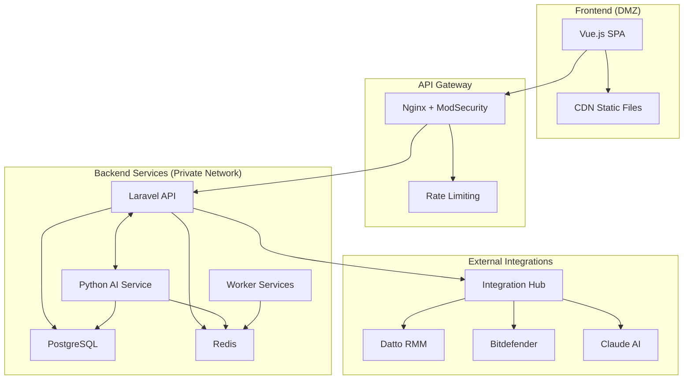

# 🚀 ITSM Platform - Enterprise IT Service Management

<div align="center">
  
  
  [](https://laravel.com)
  [](https://vuejs.org)
  [](https://fastapi.tiangolo.com)
  [](https://www.postgresql.org)
  
  **Plataforma ITSM multi-tenant com IA integrada, processos ITIL v4 e integrações enterprise**
</div>

## 🎯 Visão Geral

O ITSM Platform é uma solução enterprise completa para gestão de serviços de TI, desenvolvida com arquitetura moderna e segurança zero-trust. Combina o poder do Laravel para processos ITSM, Python/FastAPI para IA/ML, e Vue.js para uma experiência de usuário excepcional.

### ✨ Principais Features

- 🎫 **Gestão de Incidentes e Requisições** - Processos ITIL v4 completos
- 🤖 **IA Integrada** - Claude AI para automação e análise preditiva
- 🏢 **Multi-tenant** - Isolamento completo de dados por empresa
- 📊 **Analytics Avançado** - Dashboards real-time com ML insights
- 🔐 **Segurança Zero-Trust** - Arquitetura isolada e criptografia end-to-end
- 🔌 **Integrações Enterprise** - Datto RMM, Bitdefender, APIs REST/GraphQL

## 🚀 Quick Start

### Pré-requisitos

- Docker Desktop 24+ com Docker Compose
- Git 2.40+
- Make (opcional, mas recomendado)
- 8GB RAM mínimo (16GB recomendado)
- 20GB espaço em disco

### Instalação Rápida (Docker)

```bash
# Clone o repositório
git clone https://github.com/your-org/itsm-platform.git
cd itsm-platform

# Copie as variáveis de ambiente
cp .env.example .env

# Inicie todos os serviços
docker-compose up -d

# Execute as migrações
docker-compose exec laravel php artisan migrate --seed

# Acesse a aplicação
open http://localhost:8080
```

### Instalação Manual

Para setup manual detalhado, consulte [docs/setup/local-setup.md](docs/setup/local-setup.md)

## 📚 Documentação

- 📖 [Guia de Instalação Local](docs/setup/local-setup.md)
- 🏗️ [Arquitetura do Sistema](docs/architecture/system-design.md)
- 🔧 [Guia do Desenvolvedor](docs/guides/developer-guide.md)
- 📘 [Guia do Administrador](docs/guides/admin-guide.md)
- 🤖 [Instruções para Claude AI](docs/claude/instructions.md)

## 🛠️ Stack Tecnológico

### Backend
- **Laravel 11** - API RESTful com arquitetura DDD
- **FastAPI** - Serviços de IA/ML em Python
- **PostgreSQL 16** - Database principal com RLS
- **Redis 7** - Cache e queue management

### Frontend
- **Vue.js 3** - SPA com Composition API
- **TypeScript** - Type safety
- **Tailwind CSS** - Design system Defender360
- **Pinia** - State management

### DevOps & Infra
- **Docker** - Containerização
- **Railway** - Deploy de produção
- **GitHub Actions** - CI/CD
- **Prometheus & Grafana** - Monitoring

## 🏗️ Arquitetura



## 🚦 Status dos Módulos

| Módulo | Status | Progresso |
|--------|--------|-----------|
| 🎫 Gestão de Incidentes | ✅ Completo | 100% |
| 📋 Requisições de Serviço | ✅ Completo | 100% |
| 📊 Dashboard Analytics | 🚧 Em desenvolvimento | 80% |
| 🤖 IA/ML Integration | 🚧 Em desenvolvimento | 70% |
| 🔐 Multi-tenant | ✅ Completo | 100% |
| 📚 Knowledge Base | 📅 Planejado | 0% |
| 🔌 Integrações | 🚧 Em desenvolvimento | 60% |

## 🧪 Testes

```bash
# Executar todos os testes
make test

# Testes específicos
make test-backend    # PHPUnit
make test-frontend   # Vitest
make test-python     # Pytest
make test-e2e        # Cypress
```

## 📈 Performance

- ⚡ API Response: < 200ms (P95)
- 🚀 First Paint: < 1.5s
- 💾 Memory Usage: < 512MB per container
- 📊 Concurrent Users: 1000+

## 🔐 Segurança

- 🛡️ Zero-Trust Architecture
- 🔒 Criptografia AES-256
- 🔑 OAuth2 + JWT
- 📝 Audit logging completo
- 🚨 Rate limiting por tenant

## 🤝 Contribuindo

Adoramos contribuições! Por favor, leia nosso [Guia de Contribuição](CONTRIBUTING.md) antes de submeter PRs.

```bash
# Fork o projeto
# Crie sua feature branch
git checkout -b feature/amazing-feature

# Commit suas mudanças
git commit -m 'feat: add amazing feature'

# Push para a branch
git push origin feature/amazing-feature

# Abra um Pull Request
```

## 📄 Licença

Este projeto está licenciado sob a [MIT License](LICENSE).

## 🆘 Suporte

- 📧 Email: suporte@defender360.com.br
- 💬 Discord: [Defender360 Community](https://discord.gg/defender360)
- 📚 Docs: [docs.defender360.com.br](https://docs.defender360.com)

## 🙏 Agradecimentos

- Time Defender360 pelo design system
- Comunidade Laravel e Vue.js
- Anthropic pela integração Claude AI

---

<div align="center">
  Feito com ❤️ pela equipe Defender360
</div>
